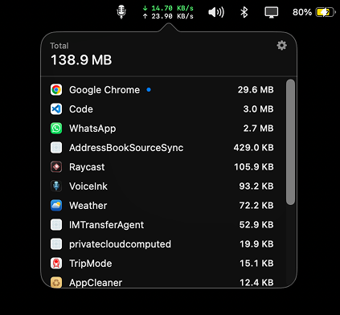

<p align="center">
  
</p>

<h1 align="center">NetworkMonitor</h1>

<p align="center">
  <b>Live network speed in your macOS menu bar — and the apps behind it.</b>
</p>

<p align="center">
  <a href="https://github.com/kevinabouhanna/NetworkMonitor/actions/workflows/ci.yml"></a>
  
  
  
  
</p>

---

Your download and upload speed, always visible in the menu bar. Click it for
today's total and a per-app breakdown of who used it.

<p align="center">
  
</p>

## Features


- **Live speed in the menu bar** — download and upload on two lines, updated twice
  a second, at a fixed width so nothing jitters as the numbers change.
- **See which apps are using your data** — sorted biggest first, with icons.
  Chrome's dozen helper processes show as one *Google Chrome* row; OS daemons
  collapse into a single *System* row.
- **A total per connection** — join a different Wi-Fi network or hotspot and the
  totals start from zero, so what you see is what *this* connection has used. Open
  your hotspot somewhere new and you know exactly what each app spent on it. A
  dropout and a reconnect to the same network picks up where it left off.
- **Internet only, not LAN** — mirroring to an Apple TV, Time Machine to a NAS or a
  Plex stream from your own server all cross Wi-Fi, but none of them cost you
  internet data, so none of them are counted against you.
- **Hotspot aware** — metered connections are flagged with a `METERED` badge, and
  one setting stops your apps updating while you're on one. See below.
- **Resets at midnight** too, for a connection you never leave, and survives
  restarts and reboots.
- **Stays out of the way** — no Dock icon, no app switcher entry, no window to
  manage. Just the menu bar.

## Privacy


NetworkMonitor watches your traffic *volume*, never its contents — and it has no
way to phone home.

- **No permission prompts.** It never asks for Location, and doesn't need it. The
  only thing that ever asks for your password is the optional hotspot-metering
  helper, and only when you install it.
- **No network access.** The app makes no outbound connections of any kind. There
  is no analytics, no telemetry, no update check, no account.
- **Your data stays on your Mac**, in a single local file you can delete at any
  time.
- **Open source, MIT licensed** — read every line before you run it.

## Install


You'll need macOS 13 or later and Apple's Command Line Tools (`xcode-select
--install`). Xcode itself and an Apple Developer account are *not* required.

```sh
git clone https://github.com/kevinabouhanna/NetworkMonitor.git
cd NetworkMonitor
./Scripts/install.sh
```

That builds the app, installs it to `/Applications`, and starts it at login. Look
for the `↓`/`↑` readout in your menu bar.

To skip the login item, use `./Scripts/install.sh --no-login`.

To update later, pull and reinstall in one step:

```sh
make update
```

## Using it


**Left-click** the menu bar item for this connection's total and the app list.
**Right-click** it for Settings and Quit.

The **gear icon** in the popover opens Settings, which holds start-at-login, the
counting-since time, Reset Now and Quit.

Quitting and start-at-login are deliberately independent: quitting ends the app for
the rest of the session without turning the setting off, and turning the setting off
doesn't quit the running app.

## Stop apps updating on hotspots


One setting. Turn it on and NetworkMonitor switches off automatic updates
whenever you're on a mobile hotspot, then switches them back on when you leave.
Apps keep working normally — Chrome still browses, Slack still messages, VS Code
still edits — they just don't download new versions of themselves while you're
paying by the gigabyte. Nothing to configure, no per-app list to maintain.

It recognises tethering over Wi-Fi and over USB, from your phone or from someone
else's, and you can mark any other connection as metered by hand — a capped home
line, hotel Wi-Fi, a travel router.

Covered with no special permissions: **VLC, AppCleaner, ChatGPT, Affinity,
VoiceInk** and any other app using Sparkle; **Microsoft AutoUpdate**; **Figma**;
**Visual Studio Code**; and **Google Chrome**.

Run `make helper` once, and it also covers **macOS system updates, the App Store,
Claude, Slack and Canva**. That step asks for your administrator password,
because those live in root-owned files. Claude and Slack in particular honour
*only* managed policy — an ordinary `defaults write` is read by neither — which
is why they cannot be covered without it. The helper it installs can do exactly
three things — suppress, restore, report — and the settings it touches are
compiled into it, so it cannot be asked to change anything else. Remove it any
time with `make uninstall`.

`make helper` also installs a small job that runs hourly, so that if you delete
NetworkMonitor by dragging it to the Trash, **the helper's own** changes — the
system update settings, the managed policies, its `/etc/hosts` entries — are put
back and the helper removes itself. It does not undo the settings listed above
that need no password; its state is root-side and it never reads the app's
journal. The cost is one extra row in System Settings › General › Login Items &
Extensions, because macOS lists every background job separately and can only
group one under its app when the app has a Developer ID team — an ad-hoc
signature has none.

`make helper-no-daemon` skips that job. Coverage while running is identical and
NetworkMonitor stays the only row in Login Items; in exchange nothing is undone
automatically, so `make uninstall` is the way to remove it. The settings pane
tells you which arrangement you have.

Three things worth knowing:

- **Everything it changes is your app's own "check for updates automatically"
  setting**, not a firewall. A manual *Check for Updates…* still works, which is
  the point: it stops unattended downloads, not you.
- **"Stops updating" includes security updates.** There's no reliable way to tell
  a security patch from a feature release, and pretending otherwise would be
  worse than saying so. Turn the setting off, or leave the hotspot, and
  everything resumes.
- **`make uninstall` puts every setting back exactly as it found it** — it reverts
  first, then deletes. Dragging the app to the Trash does not: the settings that
  need no password stay switched off, because the record of what to restore is the
  app's own journal and nothing is left running to read it. Reinstalling the app
  *does* restore them, since that journal survives and is replayed at launch. So
  if you have already trashed it, put it back and run `make uninstall` properly.

## What the numbers mean


**Your speed and connection total are always accurate.** They come straight from the
kernel's own byte counters, cost about a tenth of one percent of a CPU core, and run
all the time. They've been measured at 99.6–100.2% agreement with the kernel across
three independent transfers.

**Per-app numbers now run all the time too**, on every network and on battery, with
no setting to forget. That used to cost about 1.4 CPU cores, which is why earlier
versions switched per-app tracking off unless you were plugged in. The cost turned
out to be a bug, not a price: the tool macOS provides polls its input for
keystrokes, it was being given an input that is always "ready", and so it spun on
an empty loop forever. Given an input that waits properly, the same data costs
**0.55% of a core** — 256× less — and arrives just as fast.

It also adapts on its own, with nothing to configure: **plugged in**, it samples
every second for the freshest possible numbers; **on battery**, every three seconds.
Your totals are identical either way — the tool reports the bytes moved *between*
samples, so sampling less often changes how fresh the figures are, not how complete.
Settings tells you which mode is in force.

So there is nothing left worth switching off, and nothing to trade. Per-app rows
still won't quite add up to the connection total: some traffic is wire-level
overhead belonging to no app, and the final second before you quit is never
completed. **The big total is the one to trust.**

> Numbers here won't match Activity Monitor or TripMode, and shouldn't. Activity
> Monitor counts bytes since each process *started* — often days ago. This app
> reports what it saw on the connection you are on, since you joined it.

## Uninstall


```sh
./Scripts/uninstall.sh            # remove the app and login item
./Scripts/uninstall.sh --purge    # also delete usage history
```

If you set up hotspot metering, `uninstall.sh` restores every setting it changed
*before* it deletes anything, and removes the helper too. **Dragging the app to the
Trash is not equivalent** — the settings that need no password stay switched off,
because the journal recording how to undo them needs the app to read it. Put the
bundle back and run the uninstaller, or reinstall: the journal is replayed at
launch either way.

## License

MIT — see [LICENSE](LICENSE).
